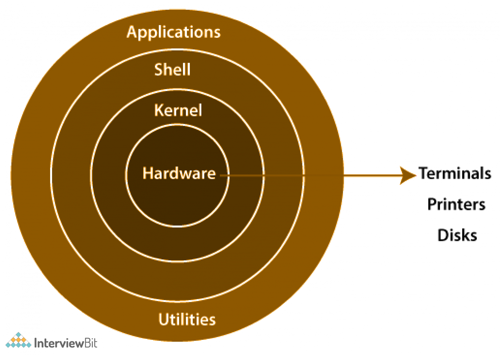

# Linux Notes

## What is Linux
Linux is an **open-source operating system** based on the Linux kernel.  
It is widely used in servers, cloud infrastructure, embedded systems, and development environments.

Unlike many commercial operating systems, Linux allows users to **view, modify, and distribute its source code** freely.

A key fact often mentioned in tech:

- Around **90% of personal computers use Windows**
- But **around 90% of servers and applications run on Linux**

This is because Linux is **stable, secure, customizable, and efficient for servers and development**.

---
## Linux Architecture Diagram

## Types of Applications

Applications can mainly be divided into two types:

### Standalone Applications
Standalone applications run **directly on a computer without needing a web browser or internet connection**.

Examples:
- MS Word
- VLC Media Player
- Calculator apps

### Web Applications
Web applications run on **servers and are accessed through web browsers over the internet**.

Examples:
- Gmail
- Facebook
- Online banking systems

## Web Server vs App Server

### Web Server
A **web server** handles **static content** and delivers it to users through HTTP & HTTPS.

Static content includes:
- HTML files
- CSS files
- Images
- JavaScript files

Example Web Servers:
- Nginx
- Apache

### Application Server
An **application server** handles **dynamic content**.  
It runs backend logic and processes user requests.

Examples:
- Django (Python)
- Node.js (JavaScript)
- Spring Boot (Java)

Dynamic content examples:
- Login systems
- Database queries
- Personalized dashboards

---

## Windows vs Linux

### Windows
- Commercial and **licensed operating system**
- Mostly used for **general personal computing**
- Graphical interface focused
- Less terminal-based work

### Linux
- Distributed under **General Public License (GPL)**
- Strong focus on **development and server environments**
- Heavy use of **terminal, scripting, and automation**
- Highly customizable

---

## What is a Kernel

The **kernel is the core (heart) of an operating system**.

It acts as a bridge between:
- Hardware (CPU, memory, devices)
- Software (applications and programs)

The kernel controls how the system uses hardware resources.

---

## Linux Kernel

The **Linux kernel** manages communication between hardware and software.

Main responsibilities include:
- Process management
- Memory management
- Device management
- File system management
- System security

It ensures programs can safely access system resources.

---

## Shell Scripting

A **shell** is a command-line interface that allows users to interact with the operating system.

Shell scripting is a way to **write scripts that communicate with the Linux kernel and automate tasks**.

Common shells:
- Bash
- Zsh
- Sh

Example uses:
- Automating system tasks
- Running multiple commands automatically
- Managing servers

---

## Bootloader

A **bootloader** is a program that runs when a computer starts.

Its job is to:
- Load the operating system into memory
- Start the kernel
- Initialize the system

Without a bootloader, the operating system cannot start.

---

## Types of Bootloaders

### GRUB (Grand Unified Bootloader)

GRUB is the **most commonly used bootloader in Linux systems**.

Responsibilities:
- Loads the Linux kernel
- Manages the boot process
- Allows selecting between multiple operating systems

Example:
A system with both **Linux and Windows** can use GRUB to choose which OS to start.

## System Level Commands

| Command | Description | Example |
|-------|-------------|--------|
| `uname` | Displays system information such as OS name, kernel version, and architecture. | `uname -a` |
| `uptime` | Shows how long the system has been running along with current load average. | `uptime` |
| `date` | Displays the current system date and time. | `date` |
| `who` | Shows the list of users currently logged into the system. | `who` |
| `whoami` | Displays the username of the current logged-in user. | `whoami` |
| `which` | Shows the full path of a command or executable. | `which python` |
| `id` | Displays user ID (UID), group ID (GID), and groups the user belongs to. | `id` |
| `sudo` | Stands for **SuperUser DO**. Allows a permitted user to run commands with administrative privileges. | `sudo shutdown`, `sudo reboot` |
| `apt` | Package manager used in Debian-based Linux systems to install, update, and remove software packages. | `sudo apt-get install docker.io` |

## Linux Basic Commands

| Command | Description | Example |
|-------|-------------|--------|
| `ls` | Lists files and directories in the current directory. | `ls` |
| `ls -l` | Lists files with detailed information like permissions, owner, size, and date. | `ls -l` |
| `clear` | Clears the terminal screen. | `clear` |
| `mkdir` | Creates a new directory. | `mkdir project` |
| `pwd` | Shows the current working directory path. | `pwd` |
| `touch` | Creates a new empty file. | `touch file.txt` |
| `cd` | Changes the current directory. | `cd project` |
| `cd ..` | Moves one directory back (to the parent directory). | `cd ..` |
| `rm` | Removes a file. | `rm file.txt` |
| `rm -r` | Recursively removes a directory and its contents. | `rm -r cloud` |
| `cat` | Displays the contents of a file. | `cat file.txt` |
| `echo` | Prints text to the terminal or writes text to a file. | `echo "Hello Linux" > file.txt` |
| `head` | Displays the first 10 lines of a file by default. | `head file.txt` |
| `tail` | Displays the last 10 lines of a file by default. | `tail file.txt` |
| `less` | Views file content page by page (scrollable). | `less file.txt` |
| `more` | Displays file content page by page but with limited navigation. | `more file.txt` |
| `cp` | Copies files or directories. | `cp file.txt backup.txt` |
| `mv` | Moves or renames files and directories. | `mv file.txt newfile.txt` |
| `Soft Link (Symbolic Link)` | Creates a shortcut pointing to another file. | `ln -s /path/to/file softlink` |
| `Hard Link` | Creates another reference to the same file data on disk. | `ln /path/to/file hardlink` |
| `cut` | Extracts specific columns or fields from a file. | `cut -c 1-5 file.txt > output.txt` |
| `tee` | Writes output to both the terminal and a file. | `ls \| tee output.txt` |
| `sort` | Sorts lines of text files alphabetically or numerically. | `sort file.txt` |
| `diff` | Shows differences between two files. | `diff file1.txt file2.txt` |
| `wc` | Counts lines, words, and characters in a file. | `wc file.txt` |
| `vi` | Opens the `vi` text editor to create or edit files. | `vi file.txt` |
| `df` | Shows disk space usage of file systems. | `df -h` |
| `top` | Displays real-time system processes and resource usage. | `top` |
| `fuser` | Shows which process is using a file or port. | `fuser file.txt` |
| `kill` | Terminates a process using its process ID (PID). | `kill 1234` |
| `nohup` | Runs a command that continues running even after logout, output saved to `nohup.out`. | `nohup python app.py &` |
| `vmstat` | Displays system performance information such as memory, processes, and CPU usage. | `vmstat` |
| `vmstat -a` | Shows active and inactive memory information. | `vmstat -a` |

## User and Group Management Commands

| Command | Description | Example |
|-------|-------------|--------|
| `sudo adduser -m username` | Creates a new user. The `-m` flag is important because it creates a **home directory** for the user. Without `-m`, the user is created without a personal folder. | `sudo adduser -m ritesh` |
| `sudo passwd username` | Sets or changes the password of a user. | `sudo passwd ritesh` |
| `su username` | Switches from the current user to another user. | `su ritesh` |
| `cat /etc/passwd` | Displays all users in the system along with their user IDs (UID), group IDs (GID), home directory, and shell information. | `cat /etc/passwd` |
| `sudo userdel username` | Deletes a user from the system. | `sudo userdel ritesh` |
| `sudo groupadd groupname` | Creates a new group in the system. | `sudo groupadd devops` |
| `sudo gpasswd -a username groupname` | Adds a user to a specific group. | `sudo gpasswd -a ritesh devops` |
| `sudo gpasswd -M user1,user2,user3 groupname` | Adds multiple users to a group at once. | `sudo gpasswd -M ritesh,rahul,aman devops` |
| `cat /etc/group` | Displays all groups in the system and the users belonging to each group. | `cat /etc/group` |
| `sudo groupdel groupname` | Deletes a group from the system. | `sudo groupdel devops` |

## SSH (Secure Shell)

### What is SSH
SSH (Secure Shell) is a **secure network protocol used to connect to remote servers** over the internet.  
It allows users to **access and manage servers through the command line securely**.

SSH encrypts the communication between the **client (your computer)** and the **server**, which prevents attackers from reading sensitive information like passwords or commands.

---

### SSH Key Authentication

SSH commonly uses **key-based authentication** instead of passwords.

- **Private Key** → Stored securely on the **user's local machine**
- **Public Key** → Stored on the **server**

When a user tries to connect:
1. The server checks the public key.
2. The user proves ownership of the matching private key.
3. If they match, the connection is allowed.

Example key file:

This `.pem` file is the **private key** used to access the server.

---

### Connecting to an AWS EC2 Instance using SSH

Follow these steps to connect to an EC2 instance:

#### 1. Launch an EC2 Instance
- Go to AWS Console
- Open **EC2 Dashboard**
- Click **Launch Instance**
- Download the **.pem key pair file**

Example:

---

#### 2. Go to the Connect Tab
After the instance starts:

1. Select your EC2 instance
2. Click **Connect**
3. Choose **SSH Client**
4. AWS will provide a command like:

---

#### 3. Find the Directory of the `.pem` File

Check where your `.pem` file is downloaded.

Example (Downloads folder): `cd /Downloads`

---

#### 4. Go to the Correct Directory

Use the `cd` command to move to the folder where the `.pem` file exists.
Example: `ssh -i "my-key.pem" ubuntu@ec2-xx-xxx-xxx-xxx.compute.amazonaws.com`

---

#### 6. Successful Connection

After running the command, your terminal will connect to the EC2 server and you will see something like: `ubuntu@ip-172-31-xx-xx:~$`
Now you can **run Linux commands directly on your EC2 server from your terminal**.

## File Permissions in Linux

### Viewing File Permissions

You can check file and directory permissions using:

| Command | Description | Example |
|--------|-------------|--------|
| `ls -l` | Displays detailed file information including permissions, owner, group, size, and timestamp. | `ls -l` |

Example output: `-rwxr-xr-- 1 user group 1200 Mar 4 demo.sh`

Explanation:

- **First character**
  - `d` → directory  
  - `-` → regular file  

- **Next 9 characters represent permissions**
`rwx r-x r--` User Group Other

Meaning:

| Symbol | Meaning |
|------|------|
| r | Read permission |
| w | Write permission |
| x | Execute permission |
| - | Permission not granted |

Order of permissions: User → Group → Others

---

# Permission Numeric System (Binary Representation)

Linux permissions can also be represented using numbers **0–7**.

| Number | Binary | Read (r) | Write (w) | Execute (x) | Meaning |
|------|------|------|------|------|------|
| 0 | 000 | - | - | - | No permission |
| 1 | 001 | - | - | x | Execute only |
| 2 | 010 | - | w | - | Write only |
| 3 | 011 | - | w | x | Write + Execute |
| 4 | 100 | r | - | - | Read only |
| 5 | 101 | r | - | x | Read + Execute |
| 6 | 110 | r | w | - | Read + Write |
| 7 | 111 | r | w | x | Full permission |

Example permission: `chmod 777 cloud`

| Permission | Meaning |
|------|------|
| 7 | User → rwx |
| 7 | Group → rwx |
| 7 | Others → rwx |

So **777 = Full permission for everyone**.

Example:

| Command | Description |
|------|------|
| `chmod 777 cloud` | Full permissions for user, group, and others |
| `chmod 755 cloud` | User → full access, Group → read & execute, Others → read & execute |
| `chmod 715 cloud` | User → full access, Group → execute only, Others → read & execute |

---

### Umask (Default File Permissions)

`umask` defines the **default permissions assigned when new files or directories are created**.

| Command | Description | Example |
|------|------|------|
| `umask` | Displays the default permission mask for new files | `umask` |

Example output: 0022

Meaning:

- User → full permissions
- Group → read and execute
- Others → read and execute

*(You mentioned you will add the umask table image manually.)*

---

### Ownership Commands

| Command | Description | Example |
|------|------|------|
| `chown` | Changes file or directory owner | `chown devops demo.txt` |
| `chgrp` | Changes group ownership of a file | `chgrp dev demo.txt` |

---

### Zip Commands

First install zip utility:

| Command | Description |
|------|------|
| `sudo apt install zip -y` | Installs zip package |

Note:

`-y` means **automatically answer "yes" during installation**.

#### Zip Operations

| Command | Description | Example |
|------|------|------|
| `zip name.zip file.txt` | Compress a single file | `zip data.zip file.txt` |
| `zip -r name.zip folder` | Compress a directory recursively | `zip -r project.zip devops` |
| `unzip name.zip` | Extract zip archive | `unzip project.zip` |

---

### Tar Command

`tar` is commonly used in Linux to **archive and compress files or directories**.

### Difference Between ZIP and TAR

| Feature | ZIP | TAR |
|------|------|------|
| Compression | Compresses files individually | Mainly archives files |
| Linux usage | Less common in Linux systems | Very common in Linux |
| Extensions | `.zip` | `.tar`, `.tar.gz`, `.tar.bz2` |

---

#### Tar Flags

| Flag | Meaning |
|------|------|
| `c` | Create archive |
| `x` | Extract archive |
| `v` | Verbose (show progress) |
| `f` | File name |
| `z` | gzip compression |
| `j` | bzip2 compression |
| `C` | Change directory before operation |

---

#### Tar Examples

| Command | Description |
|------|------|
| `tar -cvzf name.tar.gz dev` | Create compressed archive |
| `tar -xvzf name.tar.gz` | Extract compressed archive |

## File Transfer Commands (Local ↔ Server)

### 1. SCP (Secure Copy)

`scp` is used to **securely copy files between a local machine and a remote server using SSH**.  
It encrypts the data transfer and is commonly used with **AWS EC2 instances**.

---

### Local → Server File Transfer

General command structure: `scp -i key.pem file.txt ubuntu@server-ip:/home/ubuntu`

Explanation of each part:

| Part | Meaning |
|-----|------|
| `scp` | Secure copy command used to transfer files over SSH |
| `-i` | Specifies the **private key file** used for authentication |
| `key.pem` | The **AWS private key (.pem)** used to connect to the server |
| `file.txt` | File from your **local system** that you want to transfer |
| `ubuntu@server-ip` | Username and server address |
| `:/home/ubuntu` | Destination directory on the server |

Example: `scp -i my-key.pem file.txt ubuntu@ec2-12-34-56-78.compute.amazonaws.com:/home/ubuntu`

This command will **copy `file.txt` from your local machine to the `/home/ubuntu` directory on the server**.

---

### Server → Local File Transfer

General command structure: `scp -i key.pem -r ubuntu@server-ip:/home/ubuntu/cloud`

Explanation:

| Part | Meaning |
|-----|------|
| `scp` | Secure copy command |
| `-i key.pem` | Private key for server authentication |
| `-r` | Recursively copy directories |
| `ubuntu@server-ip` | Remote server address |
| `/home/ubuntu/cloud` | File or folder on the server |
| `.` | Current directory on local machine |

Example: `scp -i my-key.pem -r ubuntu@ec2-12-34-56-78.compute.amazonaws.com:/home/ubuntu/cloud`

This command will **copy the `cloud` directory from the server to your local machine**.

---

### 2. RSYNC (Remote Sync)

`rsync` is used to **synchronize files and directories between systems efficiently**.  
It transfers **only changed data**, making it faster than `scp` for large transfers.

---

### Remote Sync Command

General command structure: `rsync -avjz -e "ssh -i linux-dev.pem" /local/path ubuntu@server-ip:/home/ubuntu`

Explanation of flags:

| Flag | Meaning |
|----|----|
| `-a` | Archive mode (preserves permissions, timestamps, etc.) |
| `-v` | Verbose output |
| `-j` | Compression during transfer |
| `-z` | Enables compression for faster transfer |
| `-e` | Specifies remote shell to use (SSH) |

Example: `rsync -avjz -e "ssh -i Downloads/linux-dev.pem" ./project ubuntu@ec2-12-34-56-78.compute.amazonaws.com:/home/ubuntu`

This command will **synchronize the local `project` folder to the server's `/home/ubuntu` directory**.
